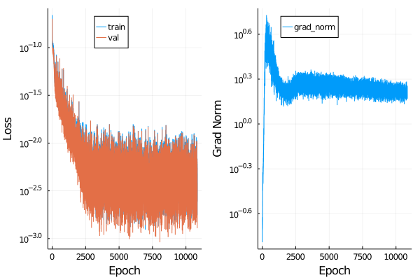

# Robertson's Problem

This example demonstrate the preliminary results on learning CRNN for systems with strong stiffness. Robertson's problem is a classical stiff chemical kinetic problems widely adopted to test stiff ODE solvers. The details of Robertson's problem and the introductions to stiffness can be found in https://arxiv.org/abs/2011.04520 and https://diffeq.sciml.ai/stable/tutorials/advanced_ode_example/.

We are actively working on understanding the difficulties of learning stiff Neural Ordinary Differential Equations. We will phase out a nice story on it soon.

For this Robertson's problem, a note on the number of proposed reactions is that proposing a onver-parameterized model seems to be easier to optimize. For instance, we know this system can be well approximated by a three-reaction systems. However, it could be difficult to optimize due to local minima. Instead, if we propose 6 reactions, the chaance of successful optimization is much higher. To get a sparse model for better interpretability, we could employ standard model reduction methods to identify essential pathways. For example, the leave one out method, one can disable a reaction each time and see the effect. Tne you will be able to identify the essential three reactions.

## Loss funtions

## Profiles

